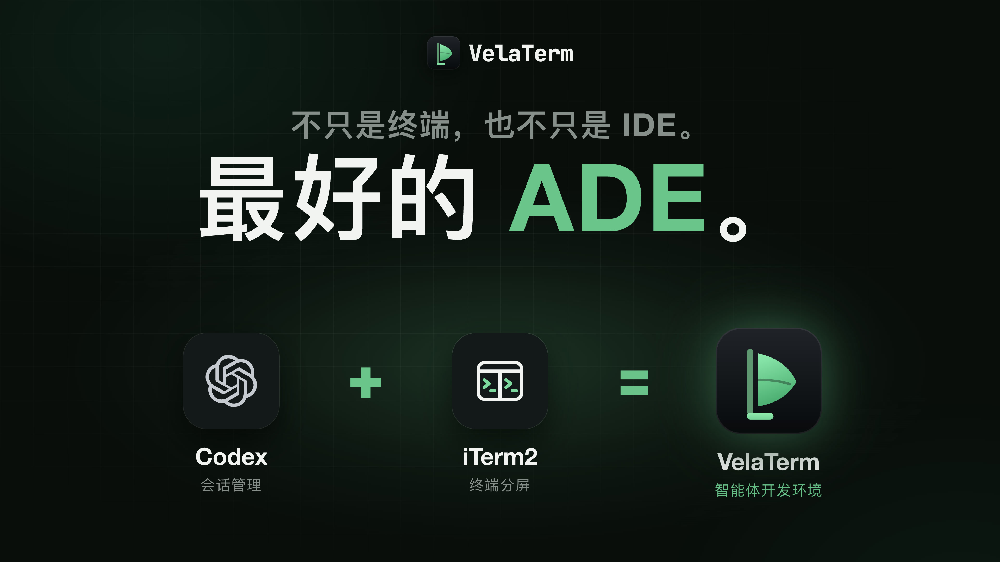

# VelaTerm

[English](README.md) | 简体中文

**最好的 ADE。** 不只是终端，也不只是 IDE。

像 Codex 一样管理智能体会话，像 iTerm2 一样分屏使用终端。VelaTerm 把两者放进同一个原生应用，还能在浏览器和手机上继续使用。

[](LICENSE)
[](https://velaterm.com/zh-CN)
[](https://www.bilibili.com/video/BV11oag6dEyt/)
[](https://x.com/vlinx_soft)
[](https://discord.gg/gaD4NBzggU)

<a href="https://www.bilibili.com/video/BV11oag6dEyt/"></a>

**[观看介绍视频（2:55）](https://www.bilibili.com/video/BV11oag6dEyt/)** ·
**[下载](https://velaterm.com/zh-CN/download)** ·
**[用户手册](https://velaterm.com/zh-CN/docs)**

## 工作空间

### 主流编程智能体，全面支持

支持 Claude Code、Codex、OpenCode、Copilot、Cursor、Antigravity、Cline、Pi 等编程智能体。每个智能体都在独立会话中运行，支持实时状态查看、会话恢复与自定义启动参数。


### 一套完整的智能体开发环境

在会话视图中查看智能体的计划、改动、命令与测试结果；也可以把同一个会话切换到终端视图，直接使用智能体自己的 TUI。


### 会话按树形层级组织

项目 → 分组 → 嵌套子分组 → 会话。会话再多，也一样井井有条。每个会话都是真实的伪终端，切到别处后仍在后台运行，多个会话还可以分屏并排显示。

<p align="center"></p>

### 命令与路径，输入即有提示

输入时实时弹出命令与路径建议，用方向键选择，按 Tab 键即可补全。


### 智能体需要你介入时，第一时间提醒

会话状态随对话实时更新，在会话树和状态栏中清晰可见；智能体完成工作、等待你处理时，桌面会弹出通知。


### 用量与资源，实时可见

智能体工作时，右栏实时显示订阅额度、上下文、Token 用量与系统负载。

<p align="center"></p>

## 多智能体协作

### 一条命令，派生子会话

智能体可以用 `vspawn` 把旁支任务交给子会话：选择智能体、模型和推理强度，按需分配独立的工作树；子会话会出现在父会话下方。


### 不同智能体，跨会话通信

Claude、Codex、OpenCode、Pi 等不同智能体的会话之间，可以互相搜索对话、就对话内容提问，也能直接发消息。

| 命令 | 作用 |
|------|------|
| `vsearch` | 搜索所有会话 |
| `vrefer` | 读取对话，或直接提问 |
| `vtell` | 给其他会话发消息；加上 `--steer`，消息会插入对方正在进行的回合 |


### 一个大任务，交给一组会话

规划/执行模式把一个大任务拆给多个智能体会话协作完成，每个会话只负责一件事。**规划会话**负责制定方案、拆分任务、逐项验收；**执行会话**各自在独立工作树中实现一项任务，完成后回传报告。

1. **规划。** 规划与执行可分别配置智能体、模型和推理强度。
2. **执行。** 规划会话给出拆分方案后，由你逐项调整任务和模型，确认无误再开始执行。执行会话并行推进，各自使用独立工作树，并作为规划会话的子会话显示在会话树中。
3. **验收。** 执行报告自动回传给规划会话验收，未达标的任务退回原会话继续修改，上下文完整保留。


### 会话里的结论，沉淀成知识

把会话整理进会话知识库，用本地知识库管理 Markdown 笔记，一次搜索就能同时查到两者。智能体动手前，可以先用 `vkb` 查询：

| 命令 | 查询内容 |
|------|----------|
| `vkb memories` | 会话知识 |
| `vkb notes` | 本地笔记 |
| `vkb explore` | 代码图谱，在本机完成查询，不调用 AI 模型 |

详见[笔记本使用指南](docs/manuals/knowledge-notebooks_20260910.md)（英文）。


## 内置工具

### 各类编辑器，开箱即用

自带 Markdown 所见即所得编辑器、代码编辑器与图片查看器，桌面端还内置了浏览器；连接远程服务器时同样可用。


### 任务之间，轻松片刻

从工作空间进入游戏中心，打开 Pixel Wing，用键盘、触控或手柄游玩。

<p align="center"></p>

### 其他功能

- **代码审计。** 内置 Codex Security 工作流，使用本机已登录的 Codex 或 Claude Code 运行，报告附带源码证据与覆盖范围说明，可导出 Markdown 或 JSON。详见[代码审计指南](docs/manuals/code-audits_20260908.md)（英文）。
- **Git 集成。** 每个会话显示所在分支、领先与落后的提交数以及改动数量，并提供常用操作。
- **主题与多语言。** 亮色与暗色主题可跟随系统切换，界面已完整翻译为多种语言。

## 随处可用

### 远程开发

内置远程访问：既能通过 SSH 连接远程服务器，也能通过 HTTPS 端到端加密访问完整应用。

- **桌面端。** macOS、Windows、Linux 原生应用，可在应用里直接通过 SSH 连接远程服务器。
- **浏览器。** 在任意设备上打开网址即可使用，无需安装。全程 HTTPS 端到端加密，传输链路上没有可读的明文。
- **手机。** 提供 iOS 与 Android 原生应用，扫码即连，随身查看同一棵会话树。

<p>  </p>

### 远程连接，三种方式

通过 SSH 连接远程服务器，打开配对链接，或登录账号后直接选择自己的设备。


### 会话进度，随身掌握

扫码即可连接。浏览会话树、查看智能体进展并直接回复；遇到需要你确认的操作，手机会第一时间收到推送提醒。

<p align="center"></p>

### macOS、Windows 与 Linux

同一个原生应用，覆盖主流桌面系统；Windows 完整版安装包内置 Git Bash。基于 Tauri 2 构建，安装包小巧，同时运行多个终端依然流畅。

| 平台 | 架构 | Shell |
|------|------|-------|
| macOS | Apple Silicon、Intel | zsh |
| Windows | x64、arm64 | PowerShell、Git Bash、WSL |
| Linux | x86_64、aarch64 | bash |

<p>  </p>

## 下载

从敲下第一条命令，到完成最终验收。请前往 [velaterm.com/zh-CN/download](https://velaterm.com/zh-CN/download) 下载对应平台的安装包，再从[入门指南](https://velaterm.com/zh-CN/docs/getting-started)开始使用。

## 文档

- [手册总览](https://velaterm.com/zh-CN/docs)：建议从这里开始
- [入门指南](https://velaterm.com/zh-CN/docs/getting-started)
- [AI 智能体会话](https://velaterm.com/zh-CN/docs/ai-agent-sessions)
- [远程开发](https://velaterm.com/zh-CN/docs/remote-development)
- [更新日志](https://velaterm.com/zh-CN/docs/changelog)

## 社区

- **[哔哩哔哩](https://www.bilibili.com/video/BV11oag6dEyt/)**：产品介绍与演示视频。
- **[X](https://x.com/vlinx_soft)**：版本发布公告与简短演示。
- **[YouTube](https://www.youtube.com/@vlinx_soft)**：演示视频与功能导览。
- **[Discord](https://discord.gg/gaD4NBzggU)**：提问、反馈问题与日常交流。
- **[velaterm.com](https://velaterm.com/zh-CN)**：下载、用户手册与更新日志。

## 开发

### 技术栈

| 层级 | 选型 |
|------|------|
| 桌面外壳 | Tauri 2.x（Rust 后端 + 系统 WebView）；`electron/` 目录下另有一个 Electron 外壳 |
| PTY | `portable-pty`（来自 wezterm） |
| 前端 | React 19 + TypeScript + Vite |
| 终端 | xterm.js，启用 fit、web-links、search、image、unicode11 插件 |
| 状态管理 | Zustand |
| 持久化 | SQLite，通过 `rusqlite`（内置编译） |
| 样式 | Tailwind v4，主题基于 CSS 变量 |

### 从源码构建

前置条件：Node.js、[pnpm](https://pnpm.io/)、[Rust 工具链](https://rustup.rs/)和 git。Tauri 还需要各平台的系统依赖，参见 [Tauri 前置条件指南](https://tauri.app/start/prerequisites/)。

```bash
pnpm install          # 安装前端依赖
pnpm dev:desktop      # 编译 Rust 后端并打开桌面窗口
```

其他开发模式：

```bash
pnpm dev:web          # 无界面后端 + Vite，在普通浏览器中操作
pnpm dev:electron     # 使用 Electron 外壳代替 Tauri
pnpm dev:ls           # 列出正在运行的开发实例
pnpm dev:stop <label> # 按标签停止某一个实例
```

每个开发实例都使用随机端口并带有标签，因此可以同时运行多个。`dev:web` 绑定 `0.0.0.0`，会同时打印一个局域网地址，供另一台电脑或手机访问；它默认使用 `.dev-data/` 下的独立数据库，不会影响你真实的会话树。

构建与测试：

```bash
pnpm build                                        # 类型检查并打包前端
pnpm tauri build                                  # 构建桌面应用
pnpm test                                         # 前端测试（vitest）
pnpm lint                                         # eslint
cargo test --manifest-path src-tauri/Cargo.toml   # 后端测试
```

### 目录结构

```
src/              React 前端
  layout/         三栏布局与底栏
  store/          Zustand 状态
  ipc/            invoke / listen 封装
  terminal/       xterm 实例注册表
  i18n/           翻译，以英文为键源
  remote/         浏览器远程访问与配对
  mobile/         手机浏览器布局
src-tauri/src/    Rust 后端
  pty/            PTY 管理
  db/             SQLite 持久化
  agent/          智能体识别、状态、对话记录与派生
  web/            内嵌 Web 服务与命令分发
  git.rs          Git 状态探测
electron/         Electron 外壳
skills/           在 VelaTerm 会话中提供给智能体的技能
docs/manuals/     用户手册
```

### 参与贡献

这个代码库最重要的三条约定：

1. **所有面向用户的文案都使用英文，并通过 i18n 输出**（`src/i18n/`）。英文是键源，缺少键时类型检查会失败。Rust 后端返回的文案同样适用，因为它们会直接显示在界面上。
2. **所有代码注释都使用英文书写。**
3. **请不要运行 `cargo fmt`。** Rust 源码是手工排版的，本项目不使用 rustfmt。运行它会重排大量与本次改动无关的代码，真正的改动会被淹没在 diff 里。请参照周围代码的风格书写。

凡是涉及网络或文件系统的命令都必须写成异步：同步的 Tauri 命令运行在主线程上，会导致界面卡死。

## 许可证

Copyright (c) 2026 VLINX Software。以 [MIT 许可证](LICENSE)发布。

只要随附版权声明和许可证全文，你可以出于任何目的使用、复制、修改、合并、发布、分发、再许可和出售 VelaTerm 的副本。
